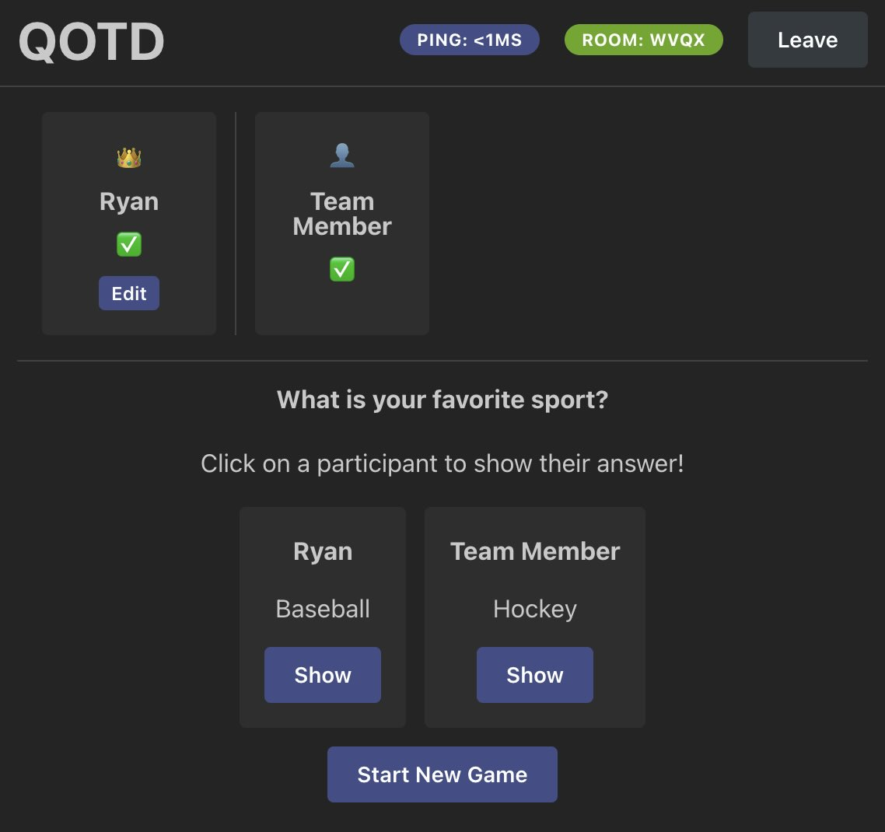

# QOTD

A realtime question-of-the-day web app supporting multiple rooms.



## Tech Stack

### Backend

- [Go](https://golang.org/)
  - [Gin](https://gin-gonic.com/)
  - [Gorilla WebSockets](https://github.com/gorilla/websocket)
  - [gin-rate-limit](https://github.com/JGLTechnologies/gin-rate-limit)
- [Redis](https://redis.io/) (optional)

### Frontend

- [React](https://reactjs.org/)
  - [Mantine](https://mantine.dev/)
  - [react-use-websocket](https://github.com/robtaussig/react-use-websocket)

## Running QOTD

### Docker

To run the application yourself, you can start the published Docker image:

```sh
docker run -d -p 9075:9075 ghcr.io/ryan-willis/qotd:latest
```

Then visit [http://localhost:9075](http://localhost:9075) in your browser.

### Development

You must have Go and Node installed on your machine to run the application in development.

macOS (via homebrew):
```sh
brew install go nvm
nvm use 22
```

Install dependencies:

```sh
npm install
```

Start the webserver:

```sh
npm run webserver
```

Then start the Vite dev server in a separate terminal:

```sh
npm run dev
```

Then visit [http://localhost:5173](http://localhost:5173) in your browser.